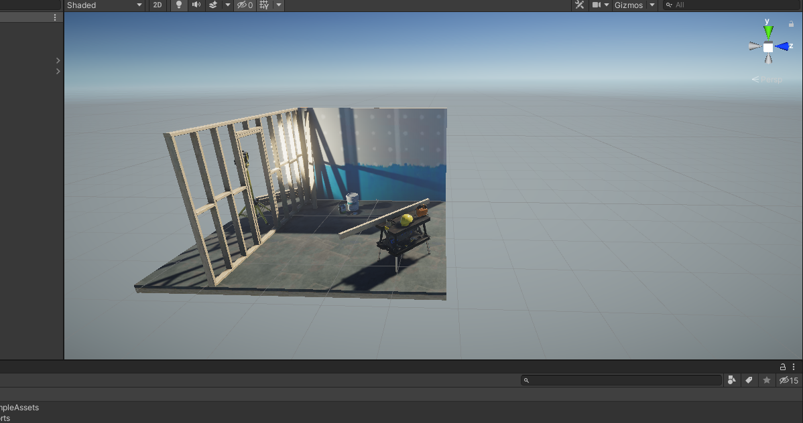

# Thursday 02-25-21

Today I had my first 1:1 with my mentor instructor. We discussed my project goals for the duration of the course. Since this course is built on project based learning, I will need to chose a project to build from scratch. At the end of the program, I will deploy either an AR or VR experience. I shared a few of my ideas, but ultimately settled on a VR experience. I'm not 100% sure on what that will include, but I have been drawn to the interection of XR and education. 

My mentor was extremely helpful in seting up my Unity environment. Since I have not worked on a PC in quite some time, I am slowly readjusting to the environment. I also set up git on my PC! So this is officially my first push from my PC.

## Tasks 
-[ ] Review [Oculus Quest Unity Setup](https://circuitstream.com/blog/oculus-quest-unity-setup)

-[ ] Review Docs for [OpenVRControllers](https://docs.unity3d.com/560/Documentation/Manual/OpenVRControllers.html)

-[ ] Roll a Ball Tutorial

-[ ] Tanks? Tutorial