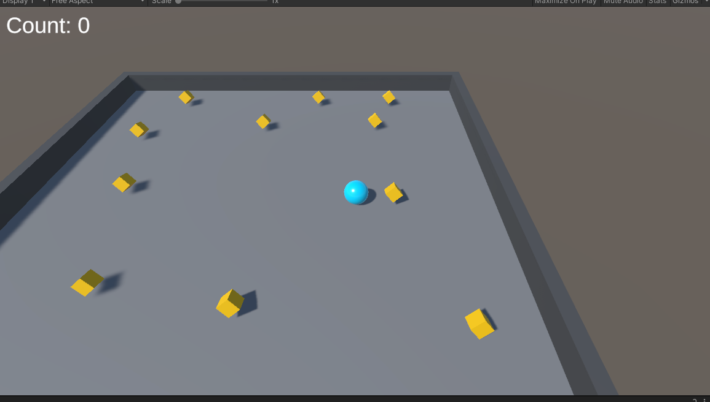

# Friday 02-26-21

I completed the Roll-a-Ball tutorial today! It was a lot of fun and I learned a lot of the basic pieces of Unity.

The game starts with the player game object, a little blue sphere, at the center of the playing plane. There are little cubes scattered around the plane that the player needs to "pick up." As the cubes are picked up, the count goes up by one and the cube disappears. Once the user picks up all the cubes, "You Win" is displayed on the screen.

