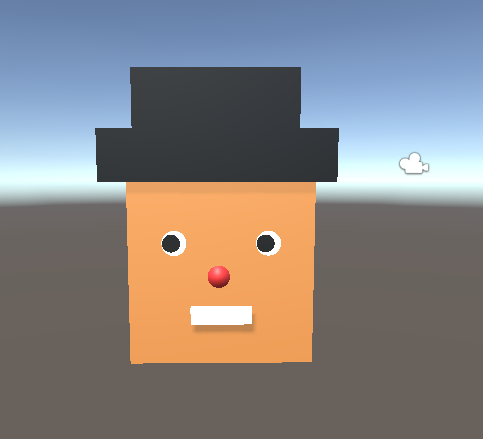
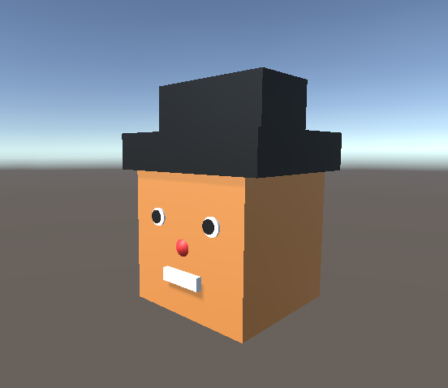

# Wednesday 02-17-21

Today I learned a few basics around Unity. I spent some time reaquainting myself with a PC. It's been a few years since I have worked on a PC! I feel like I navigate much slower 😅 After that, I attmempted to stay caught up throughout the duration of the lesson. It was definitely interesting being on the other side of a classroom setting! I am very excited and looking forward to this course!

- Navigation
- Keyboard Shortcuts
- Creating objects using shapes
- Creating materials and prefabs

This is my first creation!

