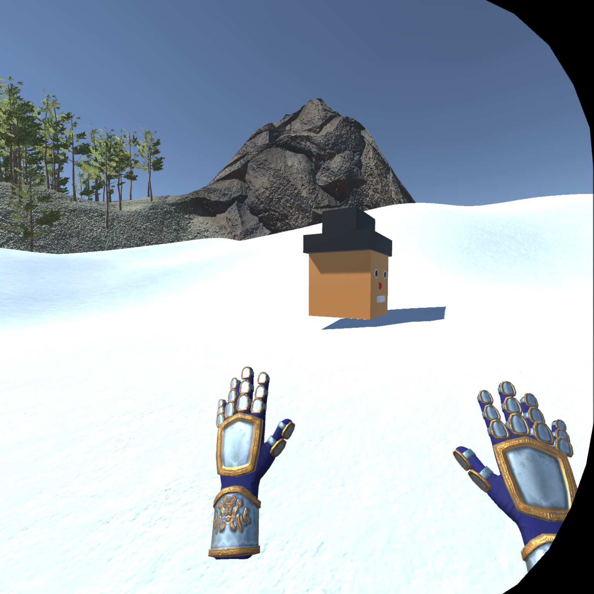

# Monday 3-8-21

I had an amazing experience tonight! Towards the end of class we started to configure our project for to view the worlds we created through the headset. I didn't get a chance to actually plug my headset in during class, so after class I spent some time trying to link my Quest2 through the Oculus desktop app and the link cable. After a few tries, it worked! I can't move around yet inside my world, but I was able to look around and see my hands moving. Can't wait for the next class

My Roll a Ball game is also live on my personal site! You can check it out [here](https://viviancan.dev/rollaball). I was able to build it using the WebGL build settings in Unity. Up next, I am finishing up the Tanks tutorial!